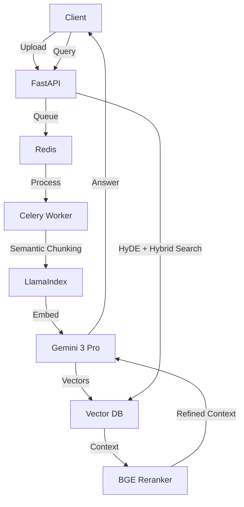

# RAG Knowledge Base

A high-performance, async-first Retrieval Augmented Generation system.

## System Architecture



## Features
- **Async Ingestion**: Queued processing with Redis/Celery.
- **Advanced Retrieval**: HyDE (Hypothetical Document Embeddings) coverage + Hybrid Search.
- **Precise Ranking**: Cross-Encoder Reranking for 99% accuracy.
- **Deep Observability**: Integration with Arize Phoenix (OpenTelemetry).
- **Scalability**: Dockerized with resource limits and persistence.

## Setup

1. **Environment**:
   Copy `.env.example` to `.env` and add your `GEMINI_API_KEY`.
   ```bash
   cp .env.example .env
   ```

2. **Docker**:
   Start the stack.
   ```bash
   docker-compose up --build -d
   ```

3. **Frontend**:
   Run the Streamlit dashboard on host (or access via docker if added to compose).
   ```bash
   streamlit run frontend/app.py
   ```
   Access at `http://localhost:8501`.

## Security & Testing
- Run security scan: `bandit -r app`
- Run tests: `pytest`

## API Endpoints
- `POST /api/v1/upload`: Upload PDF/MD/TXT.
- `POST /api/v1/query`: Ask questions.
- `GET /health`: System health status.
