# RAG Knowledge Base

A high-performance, async-first Retrieval Augmented Generation system.

## System Architecture


## Detailed Project Flow

```mermaid
graph TD
    %% Nodes
    User[👤 User]
    UI[🖥️ Streamlit Frontend]
    API[⚡ FastAPI Backend]
    Redis[📨 Redis Broker]
    Worker[👷 Celery Worker]
    Qdrant[(🗄️ Qdrant Vector DB)]
    Gemini[🧠 Gemini AI]

    %% Styles
    style User fill:#f9f,stroke:#333,stroke-width:2px
    style UI fill:#e1f5fe,stroke:#0277bd,stroke-width:2px
    style Qdrant fill:#fff3e0,stroke:#ef6c00,stroke-width:2px
    style Gemini fill:#f3e5f5,stroke:#7b1fa2,stroke-width:2px

    %% Flow: Ingestion
    subgraph Ingestion_Flow ["📂 Uploading a File"]
        User -->|1. Uploads PDF| UI
        UI -->|"2. Sends File + Session ID"| API
        API -->|3. Queues Task| Redis
        Redis -->|4. Pick ups Task| Worker
        Worker -->|5. Extracts Text & Embeds| Worker
        Worker -->|"6. Saves Vectors (Search Index)"| Qdrant
    end

    %% Flow: Retrieval
    subgraph Retrieval_Flow ["🔍 Asking a Question"]
        User -->|7. Asks Question| UI
        UI -->|"8. Sends Query + Session ID"| API
        API -->|9. Filters & Searches| Qdrant
        Qdrant -->|10. Returns Relevant Snippets| API
        API -->|"11. Sends Snippets + Question"| Gemini
        Gemini -->|12. Generates Answer| API
        API -->|13. Returns Answer| UI
    end
```



## Features
- **Turbo Backend**: 
    - **Embeddings**: FastEmbed (BAAI/bge-base-en-v1.5) running on CPU (ONNX). No Torch dependency.
    - **Parsing**: PyMuPDF (Fitz) for 10x faster PDF processing.
    - **Automated Hygiene**: Scheduled cleanup of expired session data (files & vectors) every 24h.
- **Secure File Segregation**:
    - **Session Isolation**: User uploads are logically and physically isolated by Session UUID.
    - **Permanent Knowledge**: Static docs support via `ingest_static` script.
- **High-Fidelity UI**: 
    - **Context Popup**: View actual **PDF page images** with precise yellow highlighting of cited text.
    - **Design**: Modern glassmorphism layout with efficient space usage (Collapsed Uploader).
- **Scalability**: 
    - **Dockerized**: Full hot-reloading support.
    - **Async**: Celery + Redis + Beat Scheduler for robust background processing.

## Setup

1. **Environment**:
   Copy `.env.example` to `.env` and add your `GEMINI_API_KEY`.
   ```bash
   cp .env.example .env
   ```

2. **Docker**:
   Start the stack (includes API, Worker, DB, Redis, Scheduler).
   ```bash
   docker-compose up --build -d
   ```

3. **Modules**:
   - **Frontend**: `http://localhost:8501`
   - **API Docs**: `http://localhost:8000/docs`

## Security & Testing
- Run security scan: `bandit -r app`
- Run tests: `pytest`

## Scheduler (Cleanup)
The system includes a **Celery Beat** scheduler (`celery_scheduler`) to prevent storage bloat.
- **Schedule**: Daily at **3:00 AM UTC**.
- **Logic**: Deletes session folders modified > 24 hours ago.
- **Manual Trigger**: `POST /api/v1/admin/cleanup`

**Force Cleanup (CLI)**:
To delete ALL sessions immediately (ignoring 24h rule):
```bash
docker exec rag_api python app/scripts/cleanup_sessions.py --force
```

## API Endpoints
- `POST /api/v1/upload`: Upload PDF/MD/TXT.
- `POST /api/v1/query`: RAG Query.
- `GET /health`: System health.

## Future Roadmap (v1.3)
- [ ] **Chat History Persistence**: Store chat logs in SQLite/Postgres.
- [ ] **Hybrid Search**: Implement Sparse Vectors (BM25/SPLADE) alongside Dense vectors.
- [ ] **User Authentication**: Simple username/password login.
